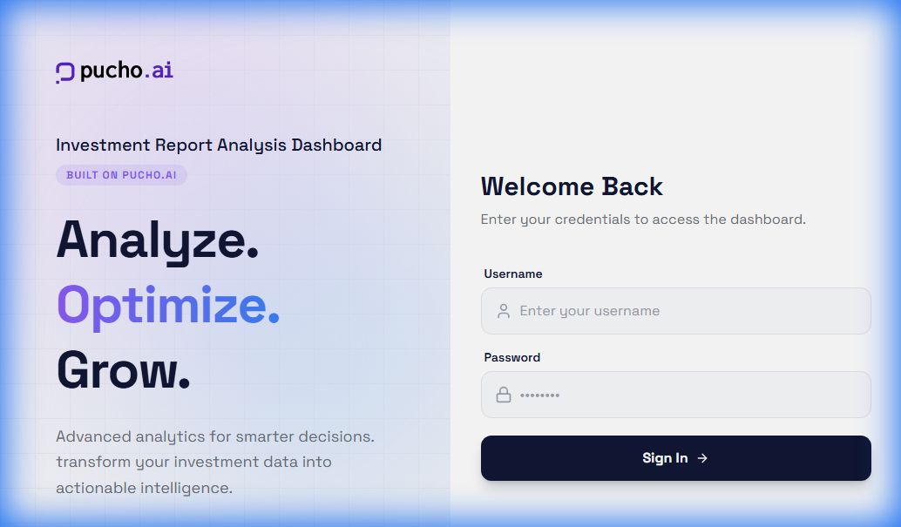
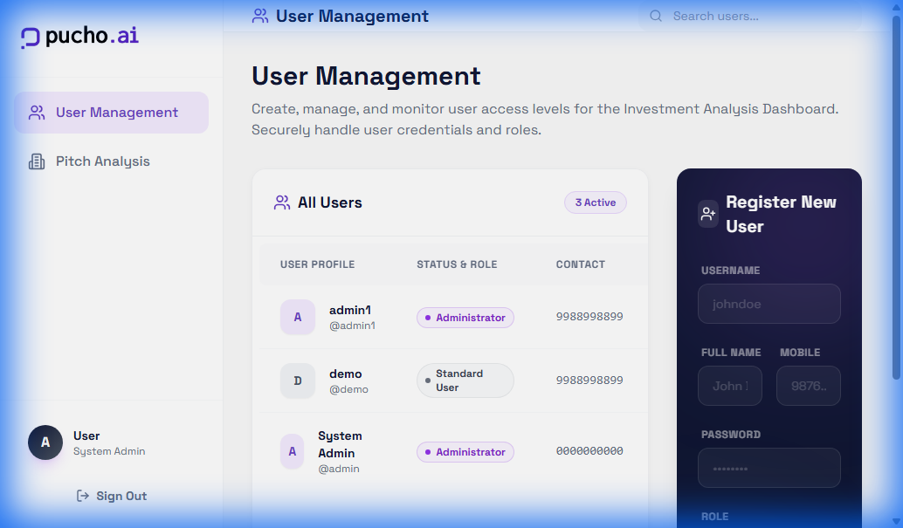
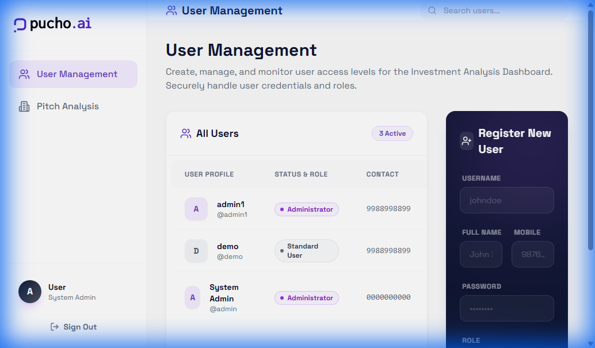

# Pucho Dashboard: The Definitive Master Specification & Design Bible

**Document Version**: 2.0 (Deep Dive Edition)
**Target Audience**: Senior Frontend Architect / Advanced Layout Generation Model
**Objective**: Build the "Investment Analysis Dashboard" for Pucho with pixel-perfect precision and deep understanding of the design ethos.

---

## 1. Executive Vision & Design Philosophy (The "Why")

**The Pucho Aesthetic** is a carefully curated blend of modern minimalism and futuristic tech. It is not "just a dashboard"; it is a premium workspace designed to evoke confidence and clarity.

### **VISUAL THEORY: "The Glass & The Glow"**
The interface is designed to feel "living" rather than static. We achieve this through a specific combination of depth, light, and motion.

*   **Atmospheric Depth**: The application does not feel flat. It lives in a 3D space created by:
    *   **Layering Strategy**: Content floats above the background, not on it. Cards act as "surfaces" suspended in space.
    *   **Refractive Glass**: We use `backdrop-filter: blur(12px)` heavily on sticky headers and modals. This is not just for style; it provides context by allowing the user to see the "ghost" of the content scrolling behind the active UI, maintaining a sense of place.
    *   **Ambient Lighting**: Soft, diffused "Orbs" of color (Purple #8b5cf6 and Blue #3b82f6) act as ambient light sources in the background, especially on the Login page. These are not sharp shapes but rather "mood setters" that subconsciously align the user with the brand identity.

*   **Tactile Feedback Loop**:
    *   **Hover Physics**: Elements don't just change color; they physically react to the cursor. A card lifts (`-translate-y-1`) and blooms (`shadow-glow`), mimicking the feel of pressing a physical button or lifting a paper.
    *   **Motion Semantics**: Every click has a ripple or a swift transition (`duration-300 ease-out`). Things don't just "appear"; they fade in or slide up, respecting the user's cognitive load.

*   **Typographic Voice**:
    *   **Font**: `Space Grotesk` is the heartbeat of this design. It is a geometric sans-serif with quirky, tech-focused details that differentiate Pucho from generic SaaS tools.
    *   **Headings**: Bold (700 or 600) with tight tracking (`-0.025em`) to feel solid and authoritative.
    *   **Data Density**: Body copy is clean (400) and spacious, ensuring that complex data tables remain scannable without looking cluttered.

---

## 2. Mandatory Technology Stack (The "Iron-Clad" Rules)

You are strictly forbidden from deviating from this stack.

| **Layer** | **Technology** | **Specific Version** | **Justification** |
| :--- | :--- | :--- | :--- |
| **Core** | **React** | `v18.2.0+` | For concurrent rendering features. |
| **Build** | **Vite** | `v5.0.0+` | For instant HMR and optimized production builds. |
| **Styling** | **Tailwind CSS** | `v3.4.0+` | For utility-first, rapid UI development. |
| **Icons** | **Lucide React** | `v0.350.0+` | For consistent, clean SVG strokes (2px). |
| **Motion** | **Framer Motion** | `v11.0.0+` | For high-fidelity entrance and exit animations. |
| **Charts** | **Recharts** | `v2.12.0+` | For responsive, composable data visualization. |
| **Backend** | **Supabase JS** | `v2.39.0+` | For Auth, Database, and Realtime subscriptions. |
| **Routing** | **React Router** | `v6.22.0+` | For client-side navigation. |

---

## 3. Comprehensive File System Architecture

This project structure is optimized for scalability. You must replicate it folder-for-folder.

```text
/
├── index.html                   # HTML Entry (Font imports go here)
├── package.json                 # Dependencies
├── tailwind.config.js           # The DESIGN TOKEN Source of Truth
├── vite.config.js               # Build Config
└── src/
    ├── main.jsx                 # Application Bootstrap
    ├── App.jsx                  # Main Routing & Route Guards
    ├── index.css                # Global Styles & Tailwind Directives
    │
    ├── lib/
    │   └── supabase.js          # Supabase Client Initialization
    │
    ├── context/
    │   └── AuthContext.jsx      # Authentication State & Logic
    │
    ├── components/
    │   ├── ui/                  # ATOMIC COMPONENTS
    │   │   ├── Button.jsx       # Primary/Secondary Buttons
    │   │   ├── Badge.jsx        # Status Pills
    │   │   ├── Input.jsx        # Form Fields
    │   │   └── Modal.jsx        # Glassmorphic Overlay
    │   │
    │   └── dashboard/           # FEATURE COMPONENTS
    │       ├── Sidebar.jsx      # Left Navigation
    │       ├── Header.jsx       # Top Bar
    │       ├── StatCard.jsx     # Metric Widget
    │       ├── PitchCard.jsx    # Investment Deal Card
    │       └── UserTable.jsx    # Admin User List
    │
    └── pages/
        ├── Login.jsx            # The Split-Screen Login Page
        ├── AdminDashboard.jsx   # The Main Application Shell
        └── Dashboard.jsx        # (Optional) User view
```

---

## 4. Visual Reference Guide (The Visual Standard)

**INSTRUCTION:** Look closely at these images. They are the "Golden Masters". Replicate the padding, the font weights, the shadow directions, and the layout proportions exactly.

### **A. The Login Experience: A Brand Portal**
*   **Narrative**: This page is the "handshake". It splits the screen 50/50. The Left is the "Dream" (Brand, Orbs, Gradient), and the Right is the "Reality" (Clean, Focused, Functional). Note how the orbs bleed into the edges, suggesting an infinite canvas.


### **B. The Admin Workspace: Control Central**
*   **Narrative**: This is where power lives. The layout is dense but organized. The sidebar on the left acts as the anchor (dark or light theme depending on preference, but here shown as light with a purple accent for the active state). The main content area uses a "Card" metaphor—the table is inside a white box with a shadow, sitting on top of the pale grey background.


### **C. The Analyst Workspace: Discovery Mode**
*   **Narrative**: This view is about "scanning". The grid layout allows the analyst to quickly process multiple opportunities. Each card is a self-contained unit of information, inviting the click with its hover lift. The icons serve as quick visual anchors—Building for stage, Dollar for money, MapPin for place.


---

## 5. Implementation Specifications (The Code Bible)

### **A. Global Design Tokens (Tailwind Config)**
*   **Rationale**: We define our colors here so we can use classes like `bg-pucho-purple` everywhere. This ensures that if we change the shade of purple later, the entire app updates instantly.

```javascript
/** @type {import('tailwindcss').Config} */
export default {
    content: ["./index.html", "./src/**/*.{js,ts,jsx,tsx}"],
    theme: {
        extend: {
            fontFamily: {
                sans: ['"Space Grotesk"', 'sans-serif'], // The Identity Font
            },
            colors: {
                pucho: {
                    dark: '#111834',      // Primary Text / Sidebar Active
                    purple: '#8b5cf6',    // Brand Accent / Hovers
                    blue: '#3b82f6',      // Gradients
                    light: '#f8f9fc',     // App Background
                }
            },
            boxShadow: {
                'glow': '0 0 20px rgba(139, 92, 246, 0.15)', // The "Pucho Glow"
                'subtle': '0 2px 10px rgba(0,0,0,0.05)',
            },
            animation: {
                'fade-in': 'fadeIn 0.5s ease-out',
                'slide-up': 'slideUp 0.4s ease-out',
            }
        },
    },
    plugins: [],
}
```

### **B. The Authentication Brain (`AuthContext.jsx`)**
*   **Rationale**: This handles the entire lifecycle of a user session.
*   **Why is this logic strict?**: Because the routing depends entirely on the `role` property (`admin` vs `user`). If this logic is loose, the protection guards will fail.
*   **Features detailed**:
    1.  **Rehydration**: On load, it checks `localStorage` to see if a session exists. This prevents the user from being logged out on refresh.
    2.  **The "Backdoor"**: For development speed, we hardcode an `admin` login. This allows you to test the admin dashboard without setting up the full backend immediately.
    3.  **Role Injection**: When a real user logs in via Supabase, we *must* also query the `profiles` table to get their role, because the standard Auth User object doesn't carry custom roles by default.

```javascript
/* REFERENCE LOGIC - DO NOT MODIFY */
import React, { createContext, useState, useContext, useEffect } from 'react';
import { supabase } from '../lib/supabase';

const AuthContext = createContext(null);

export const AuthProvider = ({ children }) => {
    const [user, setUser] = useState(null);
    const [loading, setLoading] = useState(true);

    useEffect(() => {
        // 1. REHYDRATE: Check local storage on mount
        const storedUser = localStorage.getItem('dashboard_user_data');
        if (storedUser) {
            try { setUser(JSON.parse(storedUser)); } catch (e) { console.error(e); }
        }
        setLoading(false);
    }, []);

    const login = async (username, password) => {
        // 2. BACKDOOR (Mock): Instant Admin Access
        if (username === 'admin' && password === 'admin') {
            const mockUser = {
                id: 'admin-1',
                email: 'admin@pucho.ai',
                role: 'admin',      // Critical for routing
                full_name: 'Pucho Admin'
            };
            setUser(mockUser);
            localStorage.setItem('dashboard_user_data', JSON.stringify(mockUser));
            return { success: true };
        }

        // 3. REAL AUTH (Supabase)
        try {
            const { data, error } = await supabase.auth.signInWithPassword({
                email: username, // Assuming username is email
                password: password,
            });
            if (error) throw error;
            
            // Get Role from 'profiles' table
            const { data: profile } = await supabase
                .from('profiles')
                .select('*')
                .eq('id', data.user.id)
                .single();
                
            const fullUser = { ...data.user, ...profile };
            setUser(fullUser);
            localStorage.setItem('dashboard_user_data', JSON.stringify(fullUser));
            return { success: true };
        } catch (error) {
            return { success: false, message: error.message };
        }
    };

    const logout = async () => {
        setUser(null);
        localStorage.removeItem('dashboard_user_data');
        await supabase.auth.signOut();
    };

    return (
        <AuthContext.Provider value={{ user, login, logout, loading }}>
            {!loading && children}
        </AuthContext.Provider>
    );
};

export const useAuth = () => useContext(AuthContext);
```

### **C. The Routing Skeleton (`App.jsx`)**
*   **Rationale**: Directs traffic based on authentication status. Uses "Guards" to protect pages.
*   **Flow described**:
    1.  App loads. `AuthProvider` initializes.
    2.  User hits `/admin`.
    3.  `ProtectedRoute` checks: Is `user` populated?
    4.  If No: Redirect to `/login`.
    5.  If Yes: `AdminDashboard` mounts.

```javascript
import React from "react";
import { BrowserRouter, Routes, Route, Navigate } from "react-router-dom";
import { AuthProvider, useAuth } from "./context/AuthContext";
import Login from "./pages/Login";
import AdminDashboard from "./pages/AdminDashboard";

// GUARD: Protects routes from unauthenticated users
const ProtectedRoute = ({ children }) => {
    const { user } = useAuth();
    if (!user) return <Navigate to="/login" replace />;
    return children;
};

// GUARD: Checks for specific Role (e.g. 'admin')
const RoleGuard = ({ children, role }) => {
    const { user } = useAuth();
    if (user?.role !== role) return <Navigate to="/dashboard" replace />;
    return children;
};

function App() {
    return (
        <BrowserRouter>
            <AuthProvider>
                <Routes>
                    <Route path="/login" element={<Login />} />
                    
                    {/* Admin Area */}
                    <Route path="/admin" element={
                        <ProtectedRoute>
                            <AdminDashboard />
                        </ProtectedRoute>
                    } />
                    
                    {/* Fallback */}
                    <Route path="*" element={<Navigate to="/admin" replace />} />
                </Routes>
            </AuthProvider>
        </BrowserRouter>
    );
}
export default App;
```

---

## 6. Page & Component Detailed Specs (The User Journey)

### **A. Pitch Card (`PitchCard.jsx`)**
*   **Mission**: Present a high-level summary of an investment opportunity that invites exploration.
*   **Visual Logic**:
    *   **Container Style**: `bg-white rounded-2xl border border-gray-100 p-5`. We use white to make the content pop against the `gray-50` background of the dashboard.
    *   **The "Lift"**: `hover:-translate-y-1`. This is critical. It tells the user "I am clickable".
    *   **Decorations**: The top-right corner features a subtle gradient (`bg-gradient-to-br from-purple-500/10`) to break the monotony of the white card.
*   **Content Hierarchy**:
    1.  **Header**: Flex row. Left = Company Logo Box (12x12 rounded-xl). Right = "Pitch Deck" badge (only if available).
    2.  **Body**: Company Name (Bold text-lg) + Category. We truncate long names (`truncate`) to preserve the grid structure.
    3.  **Metrics Row**: Bottom alignment. Icons + Text. This row uses a lighter grey to be secondary to the title.

### **B. Sidebar (`Sidebar.jsx`)**
*   **Mission**: The consistent anchor of the application.
*   **Visual Logic**:
    *   **Container**: `w-64 border-r`. Fixed position.
    *   **State Indication**: The active menu item uses a specialized `bg-[#F4EBFF]` (very light purple) with `text-[#6941C6]` (deep purple). This high contrast instantly tells the user "You are here".
    *   **Footer**: The User Profile sits at the bottom, separate from the navigation, acting as the "System Control" area (Settings/Logout).

### **C. User Management Table**
*   **Mission**: Allow the admin to rapidly scan and manage system access.
*   **Visual Logic**:
    *   **Header**: Sticky top with glassmorphism. This allows the admin to scroll through 100+ users while seeing column headers.
    *   **Badges**: We use "Pills" for roles.
        *   **Admin**: Purple. Admins are special; they get the brand color.
        *   **User**: Grey. Standard users are neutral.
    *   **Actions**: The "Delete" button is an icon-only button to reduce visual noise. It should have a red hover state (`hover:text-red-600`) to signal danger.

---

## 7. Operational Checklist (The Path to Production)

1.  **Scaffold**: Execute `npm create vite@latest .` to build the React engine.
2.  **Install**: Add the utility belt: `npm install lucide-react framer-motion clsx tailwind-merge`.
3.  **Configure**: Implement the `tailwind.config.js` exactly to unlock the `pucho-*` color utility classes.
4.  **Auth Layer**: Implement `AuthContext.jsx` to secure the application.
5.  **Traffic Control**: Set up `App.jsx` to handle routing.
6.  **Construct**: Build the pages (`Login`, `AdminDashboard`) following the section 6 visual specs.

**Execute this plan to generate the Dashboard.**
